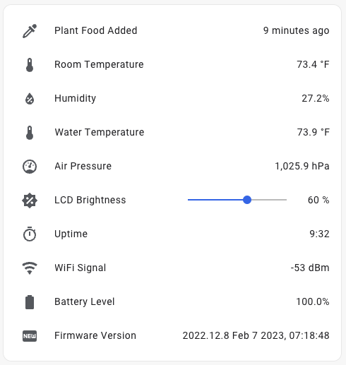

# M5StickC-Plus AeroGarden

Monitor the status of an [AeroGarden](https://www.aerogarden.com/) in [Home Assistant](http://home-assistant.io/) using a [M5StickC-Plus microcontroller](https://docs.m5stack.com/en/core/m5stickc_plus) and MQTT.


## Hardware

* AeroGarden Sprout LED
* [M5StickC-Plus microcontroller](https://docs.m5stack.com/en/core/m5stickc_plus)
* [M5Stack Ultrasonic I2C](https://docs.m5stack.com/en/unit/sonic.i2c) distance sensor
* [M5Stack ENV III](https://docs.m5stack.com/en/unit/envIII) environmental sensor
* [M5Stack NCIR](https://docs.m5stack.com/en/unit/ncir) IR temperature sensor

Sensor are mounted under the grow platform, facing down towards the water.

## Software

The contents of `src/main.py` can be pasted into [UIFlow](https://flow.m5stack.com/) and deployed to the microcontroller over-the-air, or installed directly to the microcontroller in USB mode using the [vscode-m5stack-mpy](https://marketplace.visualstudio.com/items?itemName=curdeveryday.vscode-m5stack-mpy) extension.

IntelliSense, autocompletion, and linting can be enabled in [Visual Studio Code](https://code.visualstudio.com/) by using [BradenM/micropy-cli](https://github.com/BradenM/micropy-cli):

```sh
micropy install
```

This repository contains stubs for various modules included in the UIFlow 1.9.1 firmware.

## Home Assistant

Home Assistant automatically discovers the sensors using [MQTT Discovery](https://www.home-assistant.io/docs/mqtt/discovery/).  I created 2 helper entities to control the LCD backlight and LED.  The helper entity states are published to MQTT topics using [Node-RED](https://nodered.org/).  Home Assistant automations can be used to turn the LCD off during the night, or turn the LED on when the water level is low.




## License

Copyright (C) 2022 Sam Steele. Licensed under the Apache License, Version 2.0 (the "License"); you may not use this file except in compliance with the License. You may obtain a copy of the License at

[http://www.apache.org/licenses/LICENSE-2.0](http://www.apache.org/licenses/LICENSE-2.0)

Unless required by applicable law or agreed to in writing, software distributed under the License is distributed on an "AS IS" BASIS, WITHOUT WARRANTIES OR CONDITIONS OF ANY KIND, either express or implied. See the License for the specific language governing permissions and limitations under the License.
